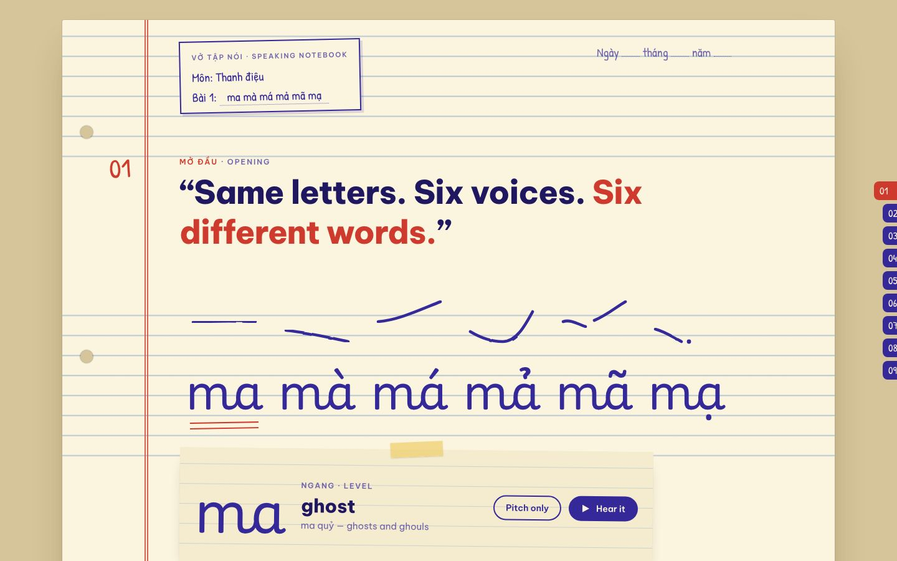
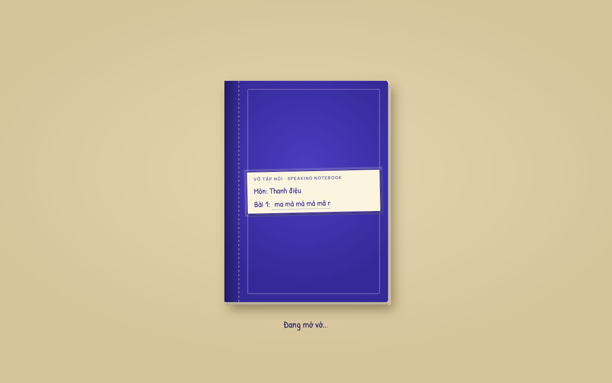
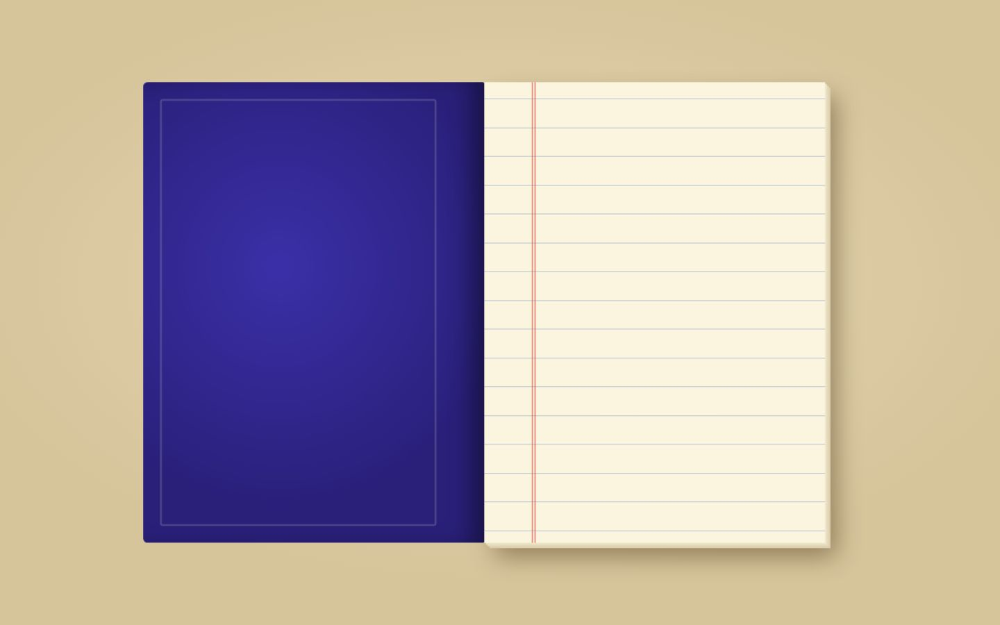
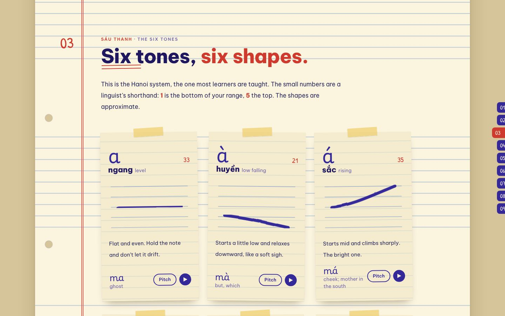
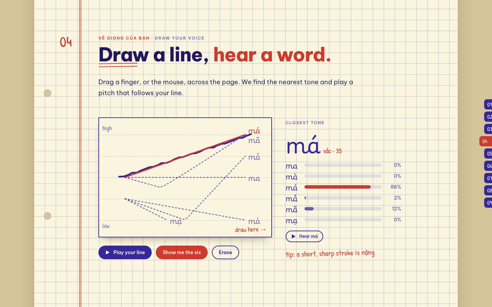
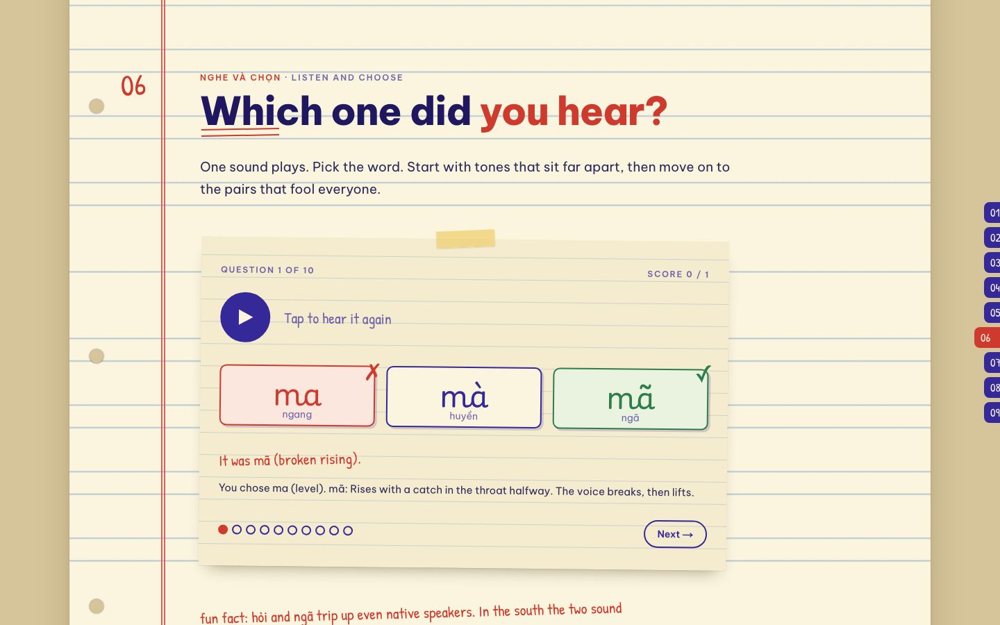
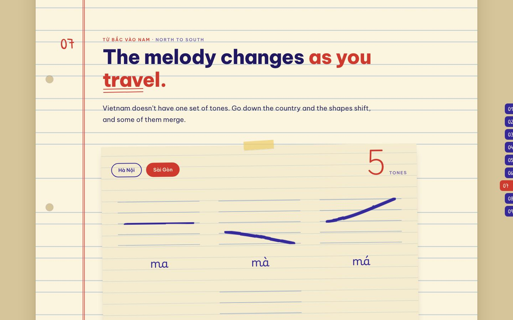
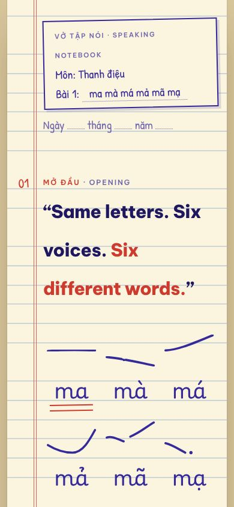

<div align="center">

# Âm Điệu

### The Six Tones of Vietnamese

**One syllable, six voices.**<br>
An interactive notebook-page tour of Vietnamese tones: listen, draw your voice, say it back.


<br>



</div>

---

## Why this exists

Say **ma, mà, má, mả, mã, mạ**. Same letters, six different words: *ghost, but, cheek, tomb, horse, rice seedling*.

In Vietnamese, pitch is part of the word, the way a letter is. That is the whole difficulty for learners, and something native speakers do every day without noticing. Âm Điệu (*âm điệu* means "melody, intonation") makes that pitch visible and audible. It is styled as a Vietnamese school exercise book (*vở*): cream paper, blue rules, a red margin, ink-blue handwriting and taped-on slips.

## Preview

<table>
  <tr>
    <td width="50%"><br><sub><b>Loading.</b> A closed exercise book whose label writes itself…</sub></td>
    <td width="50%"><br><sub>…then the cover swings open and the camera zooms into the page.</sub></td>
  </tr>
  <tr>
    <td><br><sub><b>The six tones.</b> One slip per tone, with its shape, how to say it, and an example to hear.</sub></td>
    <td><br><sub><b>Draw your voice.</b> Draw a pitch line; the nearest tone lights up.</sub></td>
  </tr>
  <tr>
    <td><br><sub><b>Listen and choose.</b> Ten questions, from far-apart tones to the pairs that fool everyone.</sub></td>
    <td><br><sub><b>North to south.</b> In the south, <i>hỏi</i> and <i>ngã</i> fall together.</sub></td>
  </tr>
</table>

<p align="center">
  
  <br><sub>It is built to work on a phone, too.</sub>
</p>

## What is inside

The page is a single long notebook page in nine sections, each numbered in the red margin. A set of index tabs on the right edge follows the section on screen.

| # | Section | What you do |
|---|---------|-------------|
| 01 | **Opening** | Six words draw themselves in. Tap one to hear it, read its meaning, or hear the pitch alone. |
| 02 | **What a tone is** | English "Really?" versus Vietnamese *ma → má*; the three things a tone carries: height, direction, texture. |
| 03 | **The six tones** | Six slips with the shape, the mark, the Chao tone numbers, how to say it and an example. Hear the word or the bare pitch. |
| 04 | **Draw your voice** | Draw a pitch line on the pad. See the nearest tone with percentages, hear your line played back, and overlay the six reference lines. |
| 05 | **Say it back** | Record one word with your microphone. Your pitch line, measured against your own range, is laid over the model line. |
| 06 | **Listen and choose** | A ten-question listening quiz with recorded words. The first half uses tones that sit far apart; the second half uses the confusable pairs. |
| 07 | **North to south** | Switch between Hà Nội (six tones) and Sài Gòn (*hỏi* and *ngã* merge, so five). |
| 08 | **Where the marks came from** | A timeline from *chữ Nôm* to *chữ quốc ngữ*, and the origin of tones. Tap the six marks to hear them. |
| 09 | **The end** | The six words, large. Honest notes about the page, and its sources. |

And around the edges:

- **A loading screen that is a book.** A closed exercise book covers the page while fonts load; when ready, the cover swings open and the camera zooms into the right-hand page. Later loads in the same session only fade. Add `?splash` to the URL to replay the full show.
- **Pen-drawn pitch curves** that sweep in left to right, like pitch over time, the first time they scroll into view.
- **Respect for the reader:** reduced-motion users get fades instead of 3D and sweeps; with scripts off the page stays readable and the loading screen clears itself.
- **Share-ready metadata:** Open Graph and Twitter cards, a hand-made share image, SVG icon, favicon, Apple touch icon and a web manifest.

## Tech stack

| Area | Choice |
|------|--------|
| Framework | [Next.js](https://nextjs.org) 16 (App Router, Turbopack, Cache Components) with React 19 |
| Language | TypeScript 5 |
| Styling | **CSS Modules**, one `.module.css` beside each component; `globals.css` holds only design tokens and a reset |
| Fonts | `next/font/google`: **Be Vietnam Pro** (text and headings), **Patrick Hand** (red-pen notes), **Playwrite VN** (the words themselves) |
| Pitch playback | Web Audio API (a triangle oscillator gliding along the tone's contour) |
| Word playback | `HTMLAudioElement` with recorded words; falls back to the glide if a file is missing |
| Drawing pad | Canvas 2D and Pointer Events, with a six-line SVG overlay |
| Microphone | `getUserMedia`, `MediaRecorder` and `decodeAudioData`; a hand-written pitch tracker |
| Pen wobble | An SVG `feTurbulence` / `feDisplacementMap` filter on the curves |

There are no runtime dependencies beyond Next.js and React.

## Getting started

You need **Node.js 20.9 or newer** (developed on Node 24).

```bash
git clone https://github.com/trunkvn/am-dieu-vnes.git
cd am-dieu-vnes
npm install
npm run dev
```

Open <http://localhost:3000>.

| Script | What it does |
|--------|--------------|
| `npm run dev` | Start the development server (Turbopack) |
| `npm run build` | Create a production build |
| `npm start` | Serve the production build |
| `npm run lint` | Run ESLint |

> **Microphone note:** browsers only allow microphone access on `localhost` or over HTTPS.
>
> **Seeing the loading screen again:** it plays in full once per browser tab session. Open `/?splash` to replay it.

### Configuration

| Variable | Purpose |
|----------|---------|
| `NEXT_PUBLIC_SITE_URL` | The site's public URL (for example `https://example.com`). Used to build absolute URLs for the Open Graph and Twitter images. On Vercel it falls back to `VERCEL_PROJECT_PRODUCTION_URL`; otherwise to `http://localhost:3000`. |

## Project structure

```text
app/
├── layout.tsx            Fonts, site metadata, loading screen
├── page.tsx              The notebook: cover, nine sections, footer
├── globals.css           Design tokens (colours, fonts, the 32px ruled line) and a reset
├── manifest.ts           Web app manifest
├── icon.svg · favicon.ico · apple-icon.png
├── opengraph-image.png · twitter-image.png (+ .alt.txt)
│
├── _components/          Shared UI, each with its own CSS Module
│   ├── Sheet/            The desk and the ruled page (and the SVG pen filter)
│   ├── Section/ Heading/ Slip/ Note/ Button/
│   ├── InkCurve/         Pitch curves, with the scroll-triggered sweep
│   ├── SceneNav/         The index tabs
│   ├── LoadingScreen/    The book that opens
│   └── Footer/
│
├── _lib/                 No UI: data and logic
│   ├── cx.ts             Tiny class-name joiner
│   ├── tones.ts          The six tones: pitch keyframes, names, meanings, audio paths
│   ├── curves.ts         The SVG paths for each pitch contour
│   ├── audio.ts          Pitch glides and word playback
│   ├── reading.ts        Compare a pitch line with the six tones
│   ├── pitch.ts          Pitch tracking for the microphone
│   ├── recorder.ts       Microphone recording with end-of-speech detection
│   ├── quiz.ts           Quiz question generator
│   └── scenes.ts         The list of sections (drives the index tabs)
│
└── _sections/            One folder per section, in page order
    └── Cover/ Opening/ WhatIsATone/ SixTones/ DrawVoice/
        SayBack/ ListenChoose/ NorthSouth/ MarksHistory/ Ending/

public/
├── audio/phospeak/       The six recorded words
└── icons/                Manifest icons
docs/screenshots/         The images in this README
```

Folders that start with `_` are private to the App Router, so nothing in them becomes a route. To add a section, create a folder in `_sections/`, add it to `page.tsx`, and register it in `_lib/scenes.ts` so it gets an index tab.

## How it works

**Tones are data.** Each tone in `tones.ts` is a handful of pitch keyframes (`0` is the bottom of a speaker's range, `1` the top). The same keyframes draw the curve cards, drive the pitch glides, and are the references that drawings and recordings are compared with.

**Reading a drawn line.** `reading.ts` resamples the line to 32 points and scores it against each tone on its *shape* (after removing the average height), its overall *direction* (start versus end), its *height*, and its *length* (nặng is short). The scores become the percentages you see.

**Saying it back.** `recorder.ts` records one word and stops by itself once you have spoken and gone quiet. `pitch.ts` then finds the pitch every 10 ms with a normalised-autocorrelation tracker (McLeod style), smooths it, rejects impossible jumps, bridges the gaps that a creaky voice leaves, and expresses the result in semitones around the speaker's own average. That relative line is compared with the models, so a deep voice and a high one are treated alike. Nothing is uploaded: recording, decoding and analysis all happen in the browser.

**The loading screen.** It is part of the server-rendered HTML, so it shows from the first paint. A small client component waits for the `load` event and for fonts, keeps the book shut for a minimum time so its label can finish writing, then sets a state attribute; CSS 3D transforms do the rest (cover swing, then a zoom on the right-hand page, then a cross-fade into the real page). A pure-CSS animation clears it anyway if scripts never run.

**One ruled line.** The page has a 32 px line height and the rules are 32 px apart. Body text sits on multiples of that, and each section pads itself so it ends on a rule, which is what makes it feel like paper.

## Accessibility

- Every interactive thing is a real `<button>`; toggles use `aria-pressed`; feedback regions are `aria-live`.
- Vietnamese text carries `lang="vi"`.
- `prefers-reduced-motion` turns off the sweeps, the book's 3D swing and the pulse on the record button.
- Decorative SVG is `aria-hidden`; the share image has alt text.
- **Not yet covered:** the drawing pad needs a pointer and "Say it back" needs a microphone. There is no keyboard alternative for either.

## Known limitations

This is a learning project, and it says so on the page. Please read these before trusting it:

- **The pitch tracker is rough.** It cannot follow a creaky voice, which is exactly what *hỏi*, *ngã* and *nặng* have. In informal tests with reference recordings, only some tones (such as level and heavy) were recognised reliably; others were often read as the wrong tone. Treat the overlaid chart as the feedback, not the verdict.
- **Curves are simplified shapes**, not measurements, and follow the **Hanoi system**. The Sài Gòn view only shows the one merge it is sure of (*hỏi* and *ngã*); it does not claim other southern differences, and central accents are only mentioned, not modelled.
- **The quiz uses only the six *ma* words**, because those are the only recordings the project has. Sets such as *mua / múa / mùa* or *ngu / ngủ* need their own recordings.
- **Browser coverage:** developed and checked in Chrome only. The 3D loading screen and microphone path are untested on Safari, Firefox and real phones.

## Credits and sources

**Audio.** The six recorded words come from the Vietnamese tones page at [phospeak.com](https://phospeak.com/vietnamese-tones) and are used here for personal learning. They are not licensed for redistribution, so replace them with your own or licensed recordings before using this project publicly or commercially. Swap the voice by changing `AUDIO_SET` and `AUDIO_EXT` in `app/_lib/tones.ts`.

**Fonts.** [Be Vietnam Pro](https://fonts.google.com/specimen/Be+Vietnam+Pro), [Patrick Hand](https://fonts.google.com/specimen/Patrick+Hand) and [Playwrite VN](https://fonts.google.com/specimen/Playwrite+VN) from Google Fonts, self-hosted at build time by `next/font`.

**History and linguistics** (summarised in section 08; check a detail against these before relying on it):

1. Fernandes, G. & Assunção, C. (2017). [First codification of Vietnamese by 17th-century missionaries: the description of tones and the influence of Portuguese on Vietnamese orthography.](https://www.hel-journal.org/10.1051/hel/2017390108) *Histoire Épistémologie Langage* 39(1), 155–176.
2. Haudricourt, A.-G. (1954). De l'origine des tons en vietnamien. *Journal Asiatique* 242, 69–82. [English translation.](https://halshs.archives-ouvertes.fr/halshs-01678018)
3. Kirby, J. P. (2011). [Illustrations of the IPA: Vietnamese (Hanoi Vietnamese).](https://www.cambridge.org/core/journals/journal-of-the-international-phonetic-association/article/vietnamese-hanoi-vietnamese/31774A6EB2D510A1AAC7B0027FE520F4) *Journal of the International Phonetic Association* 41, 381–392.
4. For the 1915–1919 exam changes: an [Inquiries Journal article](https://www.inquiriesjournal.com/articles/634/2/examing-the-social-impacts-of-french-education-reforms-in-tonkin-indochina-1906-1938) on French education reforms in Tonkin. It is a student journal, so check it against a scholarly history.

## Ideas for later

- More quiz sets (*mua / múa / mùa*, *ngu / ngủ*) with their own recordings, and voices from the south and centre.
- A tracker that copes with creaky voice, or feedback that does not depend on tracking it.
- A keyboard- and screen-reader-friendly way to try the drawing pad.
- Automated tests for the line-reading and pitch code.

## For contributors and coding agents

`AGENTS.md` warns that this project uses a Next.js version whose APIs and conventions can differ from older releases, and points to the bundled documentation in `node_modules/next/dist/docs/`. Read the relevant guide there before changing framework-level code.

## Author

Made by **Gnoud**.

## License

No license has been chosen yet, so all rights are reserved by default. If you would like to use or adapt any of it, please ask.
